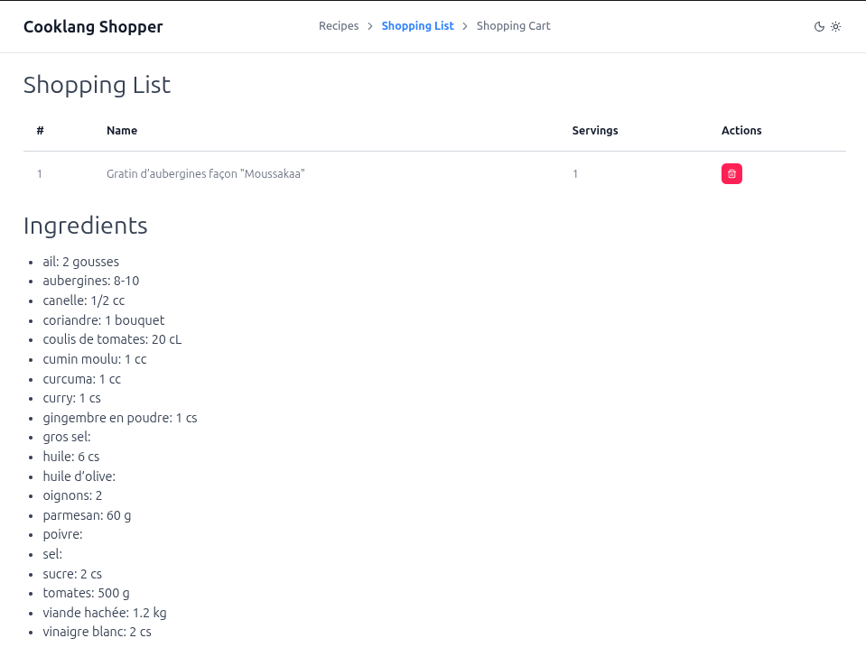

# Cooklang Shopper

Nuxt-powered UI to manage cooklang recipes, create a shopping list, fill a cart with matching products and send it to an online store

This application is in \*pre-alpha\*\* state and in active development. It is relying on a local version of [https://github.com/tmlmt/cooklang-parser](`@tmlmt/cooklang-parser`) for rapid prototyping.

ToDo:

- Finalize the flow from recipe management to sending the cart to an online store
- Add authentication
- Write proper documentation

## Teaser

