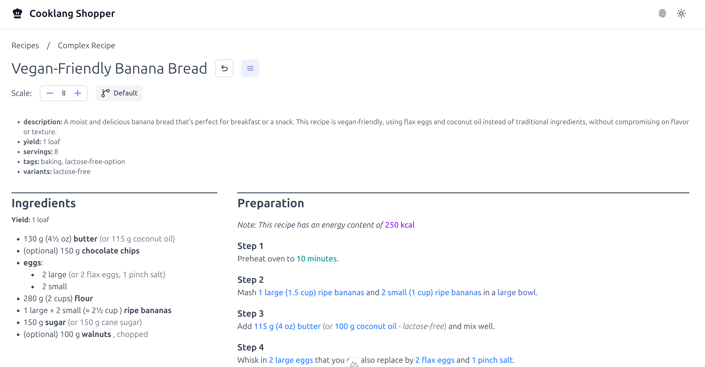

# Cooklang Shopper

<picture></picture>
<picture></picture>

Self-hosted, Nuxt-powered web app to manage cooklang recipes, create a shopping list, fill a cart with matching products and send it to an online store. Using the [https://cooklang-parser.tmlmt.com/v3](`@tmlmt/cooklang-parser` v3-alpha) Typescript parser.

The app is currently in pre-v1 i.e beta version and in active development. Only recipe management (browsing, viewing, creating, editing) is functional at the moment while the rest is partially developed and therefore hidden an `experimental` flag. Feel free to test it out and report issues or feature requests.

## Getting started

### Prerequisites

- [Node.js](https://nodejs.org/) (v22 or later)

### Installation

1. Download the latest release tarball from the [releases page](https://github.com/tmlmt/cooklang-shopper/releases)
2. Extract it to your desired installation directory:
   ```bash
   mkdir -p /path/to/cooklang-shopper
   tar -xzf cooklang-shopper-v*.tar.gz -C /path/to/cooklang-shopper
   ```
3. Create your configuration file from the provided example:
   ```bash
   cd /path/to/cooklang-shopper/dist
   cp config.yaml.example config.yaml
   ```
4. Generate a hashed password and add it to `config.yaml`:
   ```bash
   pnpx tsx scripts/hash-password.ts <your-password>
   ```
5. Add your `.cook` recipe files to `dist/public/recipes/`
6. Start the server using your favorite method (pm2, systemctl, ...) or simply:
   ```bash
   cd /path/to/cooklang-shopper/dist
   node server/index.mjs
   ```

### Upgrade

The release tarball includes an `upgrade.sh` script at the root of the installation directory. It downloads the latest release, replaces the application files, and restores your recipes, product catalog, and `config.yaml` automatically.

```bash
cd /path/to/cooklang-shopper
./upgrade.sh
```

Options:

- `--edge` — include pre-releases when finding the latest version
- `--tag <tag>` — download a specific version (e.g. `--tag v1.0.0`)

The previous version is kept in `dist.bak/` for easy rollback:

```bash
rm -rf dist && mv dist.bak dist
```

> **Note:** Stop the server before upgrading and restart it afterward.

## Roadmap

1. Stabilize recipe management
2. Handle recipe images
3. Grid view
4. Finalize shopping list features
5. Finalize shopping cart features
6. Develop feature to send cart to a pre-configured online store
7. Add customization possibilities

## Screenshot


